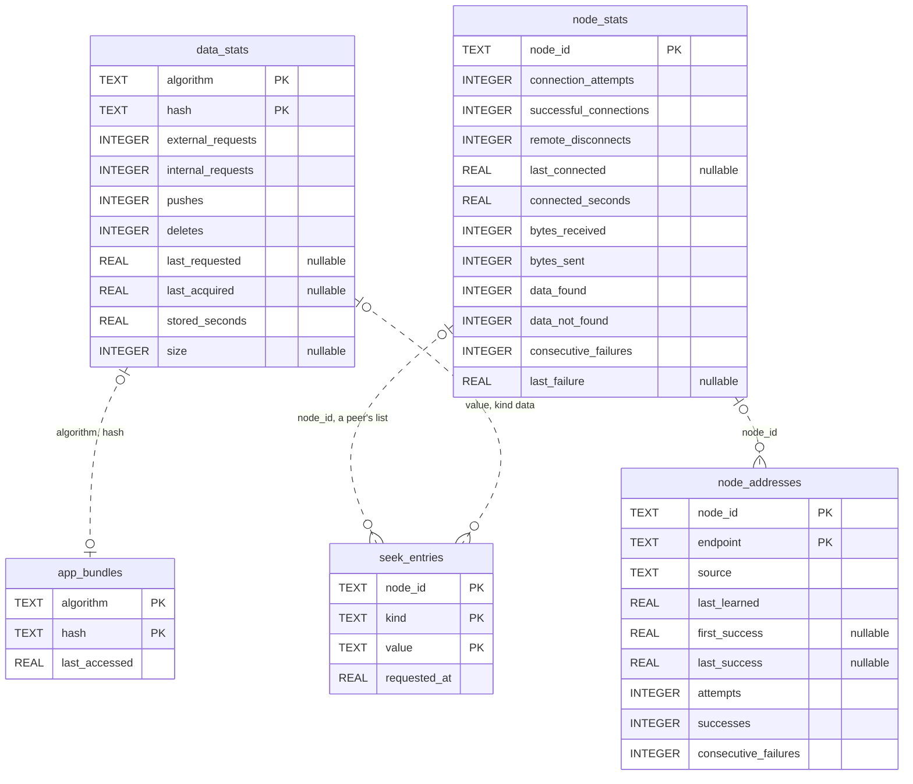

# Libranet Database Schema

Version 0.1 • September 2026

---

## 1. Purpose

This document describes the SQLite database a Libranet node keeps: its
tables, columns, and indexes, what each value means, which event writes it,
what reads it, and how long a row lives. It is written for someone about to
read or change `src/libranet/stats/`, or to look inside a node's database,
and describes the implementation as of version 0.2 and Phase 3, up to Step
77. Phase 3 changed no table.

A node has one database, `libranet.sqlite3`, with one schema, defined in
`src/libranet/stats/schema.py`. Everything else a node keeps is a plain
file, which [File Layout](File%20Layout.md) describes. [Module
System](Module%20System.md) describes the stats module, which owns the
database, and the events it records. The protocol prescribes none of this:
no other node, and no other module, ever sees a table.

## 2. The Database

| Property | Value | Where it is set |
| --- | --- | --- |
| File | `{storage.data_dir}/libranet.sqlite3`, with no setting of its own | `StorageConfig.database_path` |
| Opened by | The stats module process, on one connection | `StatsModule.on_start` |
| Journal | Write-ahead log | `PRAGMA journal_mode=WAL` in `StatsDatabase.__init__` |
| Transactions | Autocommit: each statement is its own | `isolation_level=None` |
| Rows | `sqlite3.Row`, read by column name | `row_factory` |
| Synchronous | SQLite's default, `FULL` | Not set |
| Busy timeout | Python's default, 5 seconds | Not set |
| Foreign keys | None declared, and enforcement is off | Not set |
| Schema version | None: `user_version` and `application_id` are 0 | Not set |
| Text encoding | UTF-8 | SQLite's default |

### 2.1 One Owner

Only the stats module opens the file. It opens one connection when it
starts, creating the data directory if it is missing, and closes it when it
stops. Every other module learns what the database holds from messages, or
from the list files stats derives from it (§7.2), so no table shape is known
outside `src/libranet/stats/`.

While the connection is open, `libranet.sqlite3-wal` and
`libranet.sqlite3-shm` sit beside the database. A clean stop removes both.
After a crash they stay, and the next open replays them, which is why the
write-ahead log was chosen: the supervisor restarts a module that dies, and
the database has to survive that.

### 2.2 One Statement, One Transaction

The connection is in autocommit mode, so every statement commits by itself,
and with `synchronous` at `FULL` each commit is synced to the write-ahead
log. Every write is an independent observation, and a crash loses at most
the one being made.

Two things follow:

- **An event is not atomic.** `data.stored` runs four statements (§6). A
  crash between them leaves the first ones recorded and the rest not.
- **A batch is not atomic either.** A received node list or seek list is
  written with `executemany`, one transaction for each entry.

### 2.3 How the Schema Is Applied

`apply_schema` runs every statement of `SCHEMA_STATEMENTS` each time the
database is opened. Each is `CREATE … IF NOT EXISTS`, so the same call makes
a new database and leaves an existing one alone. There is no other schema
code: no migration, no version check, no trigger, and no view. §9 describes
what that means for a database made by an older version.

The schema is five tables and two indexes, plus the index SQLite makes for
each table's primary key. All five are ordinary rowid tables; none is
`STRICT` or `WITHOUT ROWID`.

## 3. Conventions

These hold for every table:

- **A content id is two columns.** `data_stats` and `app_bundles` key on
  `algorithm` and `hash`, such as `sha256` and 64 hex digits.
- **A node id is one column.** `node_id` holds `{algorithm}/{hash}`, such as
  `sha256/0123…`. A node id is the content id of the node's public key, so
  the same identifier is split in `data_stats` and joined in `node_stats`.
  To match the two, compare `node_id` with `algorithm || '/' || hash`.
- **Identifiers are lower-case.** Every identifier written comes from a
  `ContentId`, which refuses upper-case, and search prefixes are lower-cased
  before they are stored. Columns use SQLite's default binary collation, so
  case matters in comparisons, and hashes sort as text.
- **An endpoint is text**, as node lists carry it: `{scheme}://{host}:{port}`,
  such as `http://203.0.113.9:4300`.
- **A time is `REAL`**, in seconds since the Unix epoch, from `time.time()`.
  `NULL` means it has not happened.
- **A duration is `REAL`**, in seconds, and only accumulates.
- **A counter is `INTEGER NOT NULL DEFAULT 0`**, a lifetime total that only
  goes up. The two `consecutive_failures` columns are the exception: they go
  back to 0.
- **An enumeration is `TEXT`**, holding the value of a Python `StrEnum`:
  `node_addresses.source` and `seek_entries.kind`.
- **Rows are made by upsert.** Every statement that records something is
  `INSERT … ON CONFLICT … DO UPDATE`, so a row exists from the first thing
  recorded about its key, with defaults in every other column.
- **Every primary key column is declared `NOT NULL`.** SQLite otherwise
  allows a null in a primary key column of a rowid table. A test checks
  every table for it.
- **Only `NOT NULL` and the primary keys are enforced.** There is no `CHECK`
  and no foreign key, and column types are SQLite affinities, not checks.
  What keeps values valid is that `StatsDatabase` is the only writer.

## 4. The Tables

| Table | One row per | Primary key | Record class |
| --- | --- | --- | --- |
| `data_stats` | Content id the node has heard of | `algorithm`, `hash` | `DataStats` |
| `node_stats` | Node id the node has dealt with | `node_id` | `NodeStats` |
| `node_addresses` | Place a node may be reached | `node_id`, `endpoint` | `NodeAddress` |
| `app_bundles` | Bundle an application was served from | `algorithm`, `hash` | — |
| `seek_entries` | Outstanding request, this node's or a peer's | `node_id`, `kind`, `value` | — |

The record classes are read-only snapshots of a row, in
`src/libranet/stats/records.py`.



The lines show which columns name the same thing. None is declared or
enforced, and a row on either side may have no match: an address can be
known for a node that has no statistics yet, and a bundle served from a
content archive may have no `data_stats` row. No statement joins two tables.

### 4.1 `data_stats`

What the node knows about one content id, whether or not it holds the
content. A row is made the first time the id is requested, pushed, stored,
or deleted, and is never deleted.

| Column | Type | Null | Default | Meaning |
| --- | --- | --- | --- | --- |
| `algorithm` | TEXT | no | — | Hash algorithm of the content id |
| `hash` | TEXT | no | — | Its hash, in lower-case hex |
| `external_requests` | INTEGER | no | 0 | `GET /data/{algorithm}/{hash}` requests from another machine |
| `internal_requests` | INTEGER | no | 0 | The same requests from this machine, a loopback address, and a part asked for by a file this node serves from its parts |
| `pushes` | INTEGER | no | 0 | Times it arrived: stored, or refused for not matching its hash |
| `deletes` | INTEGER | no | 0 | Times it was deleted from the source of truth |
| `last_requested` | REAL | yes | — | When it was last requested, from either |
| `last_acquired` | REAL | yes | — | When it was last added to the source of truth; kept after a deletion |
| `stored_seconds` | REAL | no | 0 | How long copies were held before each deletion, added up |
| `size` | INTEGER | yes | — | Its size in bytes as stored, while the node holds it; `NULL` otherwise |

- **`size` is what says content is held.** `data.stored` sets it, and
  `data.deleted` clears it. Stats never walks the store, so content stored
  while no database recorded it has no size, and is never offered for
  eviction (§9.1).
- **A request is counted whether or not it is answered.** A `GET` of
  content the node lacks makes a row, so the table holds ids the node has
  never held.
- **A part of a file being served counts as this node's own request**, once
  for each response, when the response first asks for it, held or not (Phase
  3 Steps 65 and 75). With no reassembled copy of the file, its parts are
  the only copy, so they are kept as content in use.
- **An upload of content already held is not counted** in `pushes`; nothing
  announces it.
- **`stored_seconds` grows only at a deletion**, by the time since
  `last_acquired`. The time the current copy has been held is not in it.
- **Requests are lifetime totals.** They survive the content being evicted
  and fetched again.
- **This node's own public key** is written at startup without an
  announcement, so it has no `size`, and eviction's ranking leaves it out by
  name as well.

Indexes: the primary key, `data_stats_by_hash`, and `data_stats_held` (§5).

### 4.2 `node_stats`

What the node knows about one other node, whatever addresses it has had. A
row is made by the first attempt to connect to the node, or the first
content exchanged with it, and is never deleted.

| Column | Type | Null | Default | Meaning |
| --- | --- | --- | --- | --- |
| `node_id` | TEXT | no | — | The node, as `{algorithm}/{hash}` |
| `connection_attempts` | INTEGER | no | 0 | Addresses dialed to reach it, whether or not they did |
| `successful_connections` | INTEGER | no | 0 | Connections to it that opened |
| `remote_disconnects` | INTEGER | no | 0 | Connections it closed, rather than this node |
| `last_connected` | REAL | yes | — | When the last connection to it opened; kept after it closes |
| `connected_seconds` | REAL | no | 0 | How long connections to it lasted, added up as each closes |
| `bytes_received` | INTEGER | no | 0 | Bytes of content stored that came from it |
| `bytes_sent` | INTEGER | no | 0 | Bytes of content pushed to it that it accepted |
| `data_found` | INTEGER | no | 0 | Fetches from it that found the content |
| `data_not_found` | INTEGER | no | 0 | Fetches from it that did not |
| `consecutive_failures` | INTEGER | no | 0 | Attempts in a row that reached it at no address |
| `last_failure` | REAL | yes | — | When the last such attempt ended |

- **The connections counted are the ones this node dials.** Every
  `connection.*` event comes from the connection manager. A peer that only
  ever dials in gets a row when content from it is stored, its public key
  included, not when it connects.
- **An attempt is counted for each address.** One try at a node with three
  addresses, none answering, adds 3 to `connection_attempts` and 1 to
  `consecutive_failures`.
- **`consecutive_failures` goes back to 0** when a connection opens, and
  when the node sends a node list that names itself. With `last_failure` it
  decides which nodes are given up on for now (§7.2).
- **`last_connected` no longer orders any list.** Since Phase 2 Step 23 the
  lists are ordered by `node_addresses.last_success`. It is kept to measure
  `connected_seconds`.
- **This node can have a row of its own.** Content this node makes itself,
  whether a backup, build, or import, or a bundle a local client makes
  (Phase 3 Steps 69 and 72), is announced as coming from this node, so its
  size is added to this node's own `bytes_received`.

Index: the primary key only.

### 4.3 `node_addresses`

Every place a node may be reached (Phase 2 Step 23). A node can have many,
and an address is only a possibly short-lived location of one. A row is
made when an address is first named in a node list, or first reached.

| Column | Type | Null | Default | Meaning |
| --- | --- | --- | --- | --- |
| `node_id` | TEXT | no | — | The node, as `{algorithm}/{hash}` |
| `endpoint` | TEXT | no | — | Where it may be reached, as `{scheme}://{host}:{port}` |
| `source` | TEXT | no | — | The strongest way the address was learned (below) |
| `last_learned` | REAL | no | — | When a node list last named it, or when it was first reached if none has |
| `first_success` | REAL | yes | — | When a connection there first proved the node's identity |
| `last_success` | REAL | yes | — | When one last did; `NULL` for an address that has never worked |
| `attempts` | INTEGER | no | 0 | Times it was dialed |
| `successes` | INTEGER | no | 0 | Times that reached the node |
| `consecutive_failures` | INTEGER | no | 0 | Failed attempts since the last success |

`source` holds a value of `AddressSource`
(`src/libranet/messaging/events.py`), listed here weakest first:

| `source` | The address was |
| --- | --- |
| `relayed` | In the node list of some other node |
| `reverse_dns` | A name found for an observed address |
| `advertised` | In the node's own node list, as its own |
| `observed` | A `localhost` entry, resolved to the address the connection came from |
| `dialed` | Reached by this node, which found the node there |

- **`source` only gets stronger.** Learning an address again replaces its
  source only with a stronger one, and reaching it sets `dialed`. The order
  is built into the SQL from the enum's own order, so adding a member
  changes the ranking with no schema change.
- **A failure is recorded only for a known address.** `connection.failed`
  updates a row and never makes one.
- **An address that has worked is kept however often it fails.** Only one
  that has never worked is dropped for failing (§8).
- **The order addresses are tried in** is: those that have worked, the most
  recently reached first, then the rest, the most recently learned first,
  then by endpoint.

Index: the primary key only, which also finds every address of one node.

### 4.4 `app_bundles`

When an application was last served from each bundle (Phase 2 Step 29). It
decides which resolved application files may be deleted to free space.

| Column | Type | Null | Default | Meaning |
| --- | --- | --- | --- | --- |
| `algorithm` | TEXT | no | — | Hash algorithm of the bundle's content id |
| `hash` | TEXT | no | — | Its hash, in lower-case hex |
| `last_accessed` | REAL | no | — | When an application was last reported served from it |

The web server reports a bundle's use at most once an hour, so
`last_accessed` can be up to an hour behind. A row is never deleted; there
is one for each bundle ever served.

Index: the primary key only.

### 4.5 `seek_entries`

Outstanding requests: content ids and search prefixes that were asked for
and not answered. This node's own entries become its `/data/seek` list
(HttpApi §10.7.1).

| Column | Type | Null | Default | Meaning |
| --- | --- | --- | --- | --- |
| `node_id` | TEXT | no | — | Whose request it is: the empty string for this node, or a peer's node id |
| `kind` | TEXT | no | — | `data` or `search` |
| `value` | TEXT | no | — | What is sought (below) |
| `requested_at` | REAL | no | — | When it was last recorded |

| `kind` | `value` is | Example |
| --- | --- | --- |
| `data` | A whole content id, `{algorithm}/{hash}` | `sha256/0123…` |
| `search` | A hash prefix, 1 hex digit up to a whole hash | `0123ab` |

- **The empty string stands for this node** (`OWN_NODE`). A real node id
  always has a `/` in it, so the two cannot collide.
- **This node's own entries** are made by a request for content it lacks
  (`data`) and by every search (`search`). Storing the content deletes its
  `data` entry. A `search` entry is never cleared, and only ages out.
- **A peer's entries** are the list it sent (`seek.received`). Each list
  adds to and refreshes that peer's rows; an entry the peer has stopped
  listing stays until it ages out. Nothing reads these rows yet.
- **Recording an entry again moves `requested_at` on**, so content that
  keeps being wanted keeps being listed.

Index: the primary key only, which also finds one node's entries of a kind.

## 5. Indexes

| Index | On | Made by | Serves |
| --- | --- | --- | --- |
| `sqlite_autoindex_data_stats_1` | `data_stats (algorithm, hash)` | Primary key | Every upsert of one content id |
| `data_stats_by_hash` | `data_stats (hash)` | Schema | Search: the known hashes either side of a prefix, across every algorithm |
| `data_stats_held` | `data_stats (hash) WHERE size IS NOT NULL` | Schema | Eviction: the held hashes either side of the node id's |
| `sqlite_autoindex_node_stats_1` | `node_stats (node_id)` | Primary key | Every upsert of one node |
| `sqlite_autoindex_node_addresses_1` | `node_addresses (node_id, endpoint)` | Primary key | Every upsert of one address; a node's addresses |
| `sqlite_autoindex_app_bundles_1` | `app_bundles (algorithm, hash)` | Primary key | Every upsert of one bundle |
| `sqlite_autoindex_seek_entries_1` | `seek_entries (node_id, kind, value)` | Primary key | Every upsert of one entry; one node's entries of a kind |

`data_stats_held` is a partial index: it holds only the rows of content
held. Eviction's ranking does not use it. That query names the table `NOT
INDEXED` and scans it in table order, because visiting the held rows through
the index, out of order, measured four times slower at 500,000 objects
(Phase 2 Step 28).

Nothing indexes a time. Every query that filters or sorts on one scans its
table (§7).

## 6. What Writes Each Row

Every write is a reaction to one event from another module, handled in
`src/libranet/stats/module.py` by a `record_*` method of `StatsDatabase`.
"Now" is the stats module's clock when it handles the event, not when the
event happened.

| Event | From | Writes |
| --- | --- | --- |
| `data.requested` | Web server | `data_stats`: `external_requests` or `internal_requests` + 1; `last_requested` = now |
| `data.not_found` | Web server, unbundler, backup | `seek_entries`: this node's `data` entry added or refreshed |
| `data.search_requested` | Web server | `seek_entries`: this node's `search` entry added or refreshed |
| `data.stored` | Validator, backup, web server, connection manager | `data_stats`: `pushes` + 1, then `last_acquired` = now and `size` set. `seek_entries`: this node's `data` entry for it deleted. `node_stats`: `bytes_received` + size, for the node it came from |
| `data.rejected` | Validator | `data_stats`: `pushes` + 1 |
| `data.deleted` | Eviction | `data_stats`: `deletes` + 1; `stored_seconds` + (now − `last_acquired`); `size` = `NULL` |
| `nodes.received` | Web server, connection manager | `node_addresses`: each entry added, or its `last_learned` = now and its `source` raised. `node_stats`: `consecutive_failures` = 0 for each node the list's sender named as itself, if it has a row |
| `seek.received` | Web server | `seek_entries`: the peer's entries added or refreshed |
| `connection.opened` | Connection manager | `node_stats`: `connection_attempts` + 1; `successful_connections` + 1; `last_connected` = now; `consecutive_failures` = 0. `node_addresses`: as `address.verified`, for the endpoint named |
| `connection.closed` | Connection manager | `node_stats`: `remote_disconnects` + 1 if the peer closed it; `connected_seconds` + (now − `last_connected`). Only if the node has a row |
| `connection.failed` | Connection manager | `node_stats`: `connection_attempts` + 1. `node_addresses`: `attempts` + 1 and `consecutive_failures` + 1, if the address is known |
| `node.unreached` | Connection manager | `node_stats`: `consecutive_failures` + 1; `last_failure` = now |
| `address.verified` | Connection manager | `node_addresses`: the row added if new; `source` = `dialed`; `first_success` set if it was `NULL`; `last_success` = now; `attempts` + 1; `successes` + 1; `consecutive_failures` = 0 |
| `data.sent` | Connection manager | `node_stats`: `bytes_sent` + size |
| `fetch.attempted` | Connection manager | `node_stats`: `data_found` or `data_not_found` + 1 |
| `app.accessed` | Web server | `app_bundles`: `last_accessed` = now |
| `eviction.candidates_requested` | Eviction | `data_stats`: as `data.deleted`, for any object it would list that is gone from the store |

Two more writes come from no event. Each time the lists are derived (§7.2),
stats first deletes the seek entries and addresses that are past keeping
(§8).

## 7. What Reads It

### 7.1 The Queries

| Query (`StatsDatabase`) | Run when | Reads | How |
| --- | --- | --- | --- |
| `eviction_order` | `eviction.candidates_requested` | `data_stats` | Two scans of the whole table, and two seeks in `data_stats_held` |
| `content_ids_near` | `data.search_requested` | `data_stats` | Two range scans of `data_stats_by_hash`, up to `storage.search_max_results` rows each |
| `last_good_endpoints` | Each derivation | `node_addresses` | Whole table, with a window function |
| `candidate_endpoints` | Each derivation | `node_addresses` | Whole table, with two window functions |
| `given_up_nodes` | Each derivation | `node_stats` | Whole table |
| `seek_values` | Each derivation, once for each kind | `seek_entries` | Primary key prefix, then sorted |
| `apps_accessed_since` | `resolved.reclaim_requested` | `app_bundles` | Whole table |
| `node_stats` | `node.unreached`, to read the new count | `node_stats` | Primary key |

`data_stats` and `node_addresses`, which return one content id's row and one
node's addresses, are called only by tests.

**Eviction's ranking** is the one costly query. The score is defined in
Python (`EvictionScorer` in `src/libranet/stats/priority.py`) and
registered on the connection as the SQL function `eviction_score` for each
request; it is not stored in the file. SQLite calls it for every row of
content held, from the row's `size`, its two request counters, the later of
`last_requested` and `last_acquired`, and its `hash`. A first scan finds the
extremes the score is measured against. Phase 2 Step 28 measured a request
at 0.3 seconds with 100,000 objects held and 3.5 seconds with a million,
during which stats records nothing else.

### 7.2 The Files Derived From It

The web server and the connection manager may not open the database, so
stats writes what they need into `{storage.cache_dir}/lists/` (File Layout
§4.1), replacing a file only when its contents change.

| File | Built from | Order |
| --- | --- | --- |
| `nodes.json` | This node's own endpoints, then `last_good_endpoints` | Each node's last reached address, if it has not failed since; most recently reached first |
| `candidates.json` | `candidate_endpoints`, less `given_up_nodes` | Nodes that have been reached first, most recently first, then the rest, most recently learned first |
| `seek.json` | `seek_values` for this node, of each kind | Most recently asked for first |

A node is given up on while its `consecutive_failures` is at least
`stats.max_node_failures` (5) and its `last_failure` is within the last
`stats.node_cool_off_seconds` (86400). Every read of `node_addresses` for a
list leaves out this node's own id.

The lists are derived when stats starts, then once
`stats.derive_interval_seconds` (60) has passed and the module is idle, and
at once when a node is given up on.

Stats also answers two events from what it reads: `eviction.candidates`,
with the objects to let go of first, and `resolved.reclaim`, with the
bundles served within `storage.resolved_idle_seconds` (2592000), whose
resolved files are to be kept. And it adds the ids `content_ids_near` finds
to a cached search response (`src/libranet/stats/enrichment.py`).

## 8. How Long a Row Lives

| Table | A row is deleted | So it grows with |
| --- | --- | --- |
| `data_stats` | Never | Every content id ever requested, pushed, or stored |
| `node_stats` | Never | Every node ever dialed, or content exchanged with |
| `node_addresses` | At each derivation, by the two rules below | The nodes known, up to `stats.max_addresses_per_node` each |
| `app_bundles` | Never | Every bundle ever served |
| `seek_entries` | When its content is stored, for this node's `data` entries; and at each derivation, once older than `stats.seek_entry_ttl_seconds` (3600) | The requests of the last hour |

An address is deleted, each time the lists are derived, when:

1. it has never worked and `stats.max_address_failures` (5) attempts in a
   row have failed; or
2. its node has more than `stats.max_addresses_per_node` (16). Those kept
   are the ones that have worked, the most recently reached first, then the
   rest: any not merely `relayed` first, then the most recently learned.

The age limit on seek entries applies to every row, a peer's as well as this
node's own.

Nothing ever runs `VACUUM`, and `auto_vacuum` is off, so the file does not
shrink when rows are deleted; the space is reused. SQLite checkpoints the
write-ahead log by its own defaults.

Deleting the file, with the node stopped, is the only reset. §9.1 lists what
is lost.

## 9. Changing the Schema

### 9.1 No Versions, No Migration

The schema has no version number, and nothing alters a table that exists.
Because every statement is `IF NOT EXISTS`:

- **A new table or index** appears in an existing database the next time
  the node starts.
- **A new column** on an existing table does not. The table is left as it
  was, and the first statement naming the column fails with `no such
  column`.
- **A changed declaration** of an existing column does not either. The
  table keeps the one it was made with.

So far each step that added a column has required the database to be
deleted, on the grounds that nothing has shipped. A database made by Phase 2
Step 28 or later works with the current code. An older one does not:
applying the schema fails on `data_stats_held` with `no such column: size`,
the stats module fails on start, and the supervisor keeps restarting it
(Module System §4.3) until the file is deleted.

Deleting the database, with the node stopped, loses:

- every peer and address, so the node falls back to its seed list (File
  Layout §6.1);
- every counter and time in `data_stats` and `node_stats`;
- which content is held. Content already in the source of truth is not
  announced again, so it has no `size` and is never offered for eviction,
  though it still counts toward `storage.max_storage_bytes`;
- when each application was last used. Resolved files of a bundle with no
  row are deleted the next time space is reclaimed, and resolved again when
  asked for;
- this node's outstanding requests, which are recorded again when asked for
  again.

### 9.2 History

| Step | Change | An existing database |
| --- | --- | --- |
| Phase 1 Step 8 (#37) | `data_stats`, `node_stats`, `seek_entries`, the index `data_stats_by_hash`, and `node_endpoints`, one endpoint for each node | — |
| Phase 2 Step 23 (#132) | `node_addresses` replaces `node_endpoints` | Gains the new table; keeps the old one, unused |
| Phase 2 Step 26 (#136) | `node_stats` gains `consecutive_failures` and `last_failure` | Must be deleted |
| Phase 2 Step 28 (#139) | `data_stats` gains `last_requested` and `size`; the index `data_stats_held` | Must be deleted |
| Phase 2 Step 29 (#143) | `app_bundles` | Gains the new table |
| #173 | `node_stats.node_id` is declared `NOT NULL` | Keeps the old declaration, which allows a null; nothing writes one, so it works as it is |

### 9.3 What a Change Touches

A change to the schema is a change to each of these:

1. `src/libranet/stats/schema.py`: the statement, and the module docstring
   that describes each table.
2. `src/libranet/stats/records.py`: the field and its line in `from_row`,
   for the three tables that have a record class.
3. `src/libranet/stats/database.py`: the statements. A column name built
   into SQL text must be one of the module's own constants, never a value
   from a caller; values always go in as named parameters.
4. `tests/test_stats_database.py`, and `tests/test_stats_module.py` for the
   event that writes it.
5. This document, and File Layout §3.5, which names the tables.
6. The step's plan, which says what an existing database does: nothing, for
   a new table or index; for a new column, either a migration, which would
   be the first, or that the database must be deleted.

## 10. Looking Inside a Database

The `sqlite3` command-line tool can read the database while the node runs,
since a reader does not block the writer in write-ahead-log mode. Open it
read-only:

```text
sqlite3 -readonly -header ~/Library/Application\ Support/libranet/libranet.sqlite3
```

Do not write to it from outside. Stats waits 5 seconds for a lock and then
fails the statement, losing what it was recording, and no code expects a
row it did not write.

How much content the node believes it holds:

```sql
SELECT COUNT(*) AS objects, SUM(size) AS bytes
FROM data_stats WHERE size IS NOT NULL;
```

The most requested content, held or not:

```sql
SELECT algorithm || '/' || hash AS content_id,
       external_requests + internal_requests AS requests, size
FROM data_stats ORDER BY requests DESC LIMIT 20;
```

Every node, the most recently connected first, with how it is faring:

```sql
SELECT node_id, successful_connections, consecutive_failures,
       datetime(last_connected, 'unixepoch') AS last_connected
FROM node_stats ORDER BY last_connected DESC;
```

One node's addresses, in the order they are tried:

```sql
SELECT endpoint, source, attempts, successes, consecutive_failures,
       datetime(last_success, 'unixepoch') AS last_success
FROM node_addresses WHERE node_id = 'sha256/0123…'
ORDER BY last_success IS NULL, last_success DESC, last_learned DESC, endpoint;
```

This node's own outstanding requests:

```sql
SELECT kind, value, datetime(requested_at, 'unixepoch') AS requested_at
FROM seek_entries WHERE node_id = '' ORDER BY requested_at DESC;
```

The bundles applications were served from:

```sql
SELECT algorithm || '/' || hash AS bundle,
       datetime(last_accessed, 'unixepoch') AS last_accessed
FROM app_bundles ORDER BY last_accessed DESC;
```

`datetime(…, 'unixepoch')` shows a time in UTC.

## 11. Limits and Planned Changes

What the schema does not do yet:

- **No version and no migration** (§9.1). `PRAGMA user_version` is unused.
- **Most counters are written and never read.** The node itself reads only
  `size`, the two request counters, `last_requested`, and `last_acquired`
  from `data_stats`, and `consecutive_failures`, `last_failure`, and
  `last_connected` from `node_stats`. `pushes`, `deletes`, `stored_seconds`,
  and the other eight columns of `node_stats` are kept for a later use, as
  are `first_success`, `attempts`, and `successes` in `node_addresses`.
- **Peers' seek entries are written and never read.**
- **Three tables never lose a row** (§8). `data_stats` grows with requests,
  not with content held: each `GET` of a well-formed id the node has not
  heard of adds a row.
- **Pruning waits for a derivation, and a derivation for the module to be
  idle.** Under steady traffic both wait (Module System §5.1).
- **Eviction's ranking scans all of `data_stats`**, and stats records
  nothing while it runs (§7.1).
- **Nothing guards a value but the code that writes it**: there is no
  `CHECK` and no foreign key.
- **An event's statements are not one transaction** (§2.2).

Planned steps that will change it:

- **Step 30** (#71, blocked data, Phase 4) adds a private list of blocked
  content ids: a table of its own, or a flag on `data_stats`. Either way a
  block has to outlive the content it names, and a list is derived from it
  for the web server and the validator, since neither may open SQLite.
