# Libranet Module System

Version 0.1 • September 2026

---

## 1. Purpose

This document describes how a Libranet node is split into processes and how
those processes work together: which modules there are and what each one is
responsible for, how the supervisor starts, restarts, and stops them, and the
message bus, shared files, and signals they communicate through. It is
written for someone about to read or change the code, and describes the
implementation as of version 0.2, at the end of Phase 2.

The architecture was chosen in [Phase 1](Phase%201.md) §2 and Steps 3 and 4,
and [Phase 2](Phase%202.md) leaves it unchanged. [File
Layout](File%20Layout.md) describes the files the modules share. For the
protocol behavior the modules implement, see [High-Level
Design](../specs/HighLevelDesign.md) and [HTTP API](../specs/HttpApi.md).

Each module's docstring, in `src/libranet/{module}/module.py`, is the
reference for the payloads that module publishes and consumes. §7 gathers
them in one place but does not replace them.

## 2. Overview

```mermaid
%% Generated by https://gitdiagram.com/marcpage/libranet
flowchart TD

subgraph group_node_runtime["Node runtime"]
  node_supervisor["Process supervisor"]
  node_event_bus["Event bus<br/>[module.py]"]
end

subgraph group_http_security["HTTP and identity"]
  node_web_server["HTTP server<br/>[server.py]"]
  node_request_auth["Request authentication<br/>[authentication.py]"]
  node_signatures["HTTP signatures<br/>[signatures.py]"]
end

subgraph group_content_storage["Content and bundles"]
  node_content_ids["Content identifiers<br/>[content_id.py]"]
  node_cas_store[("Content store<br/>[store.py]")]
  node_layered_cas["Layered content<br/>[layered.py]"]
  node_bundles["Directory bundles<br/>[layering.py]"]
  node_applications["Web applications<br/>[packaged.py]"]
  node_backup_restore["Backup and restore"]
end

subgraph group_peer_network["Peer networking"]
  node_fetcher["Missing-content fetcher<br/>[module.py]"]
  node_connections["Peer connections<br/>[peer_session.py]"]
  node_peer_exchange["Peer discovery<br/>[peer_exchange.py]"]
  node_search["Prefix search<br/>[search.py]"]
end

subgraph group_operations["Node operations"]
  node_stats[("Network statistics<br/>[database.py]")]
  node_eviction["Storage eviction<br/>[module.py]"]
  node_config["Node configuration<br/>[models.py]"]
end

node_user_peer(("User or peer"))

node_user_peer -->|"sends HTTP"| node_web_server
node_web_server -->|"authenticates requests"| node_request_auth
node_request_auth -->|"verifies signatures"| node_signatures
node_web_server -->|"reads and writes"| node_cas_store
node_web_server -->|"parses identifiers"| node_content_ids
node_web_server -->|"publishes events"| node_event_bus
node_web_server -->|"runs prefix search"| node_search
node_search -->|"scans local content"| node_cas_store
node_web_server -.->|"requests missing content"| node_fetcher
node_fetcher -->|"publishes fetch events"| node_event_bus
node_fetcher -->|"requests peer fetch"| node_connections
node_connections -->|"reports fetch result"| node_fetcher
node_connections -->|"exchanges HTTP"| node_user_peer
node_web_server -.->|"serves bundled apps"| node_applications
node_applications -->|"builds bundles"| node_bundles
node_bundles -->|"names content"| node_content_ids
node_bundles -.->|"stores bundle parts"| node_cas_store
node_backup_restore -.->|"creates and restores"| node_bundles
node_peer_exchange -.->|"exchanges peer lists"| node_connections
node_eviction -->|"hands off content"| node_connections
node_eviction -->|"deletes content"| node_cas_store
node_stats -.->|"enriches cached results"| node_search
node_supervisor -->|"starts processes"| node_event_bus
node_supervisor -->|"starts module"| node_web_server
node_config -->|"configures storage"| node_cas_store

click node_supervisor "https://github.com/marcpage/libranet/blob/main/src/libranet/supervision/process_supervisor.py"
click node_event_bus "https://github.com/marcpage/libranet/blob/main/src/libranet/messaging/module.py"
click node_web_server "https://github.com/marcpage/libranet/blob/main/src/libranet/webserver/server.py"
click node_request_auth "https://github.com/marcpage/libranet/blob/main/src/libranet/identity/authentication.py"
click node_signatures "https://github.com/marcpage/libranet/blob/main/src/libranet/identity/signatures.py"
click node_content_ids "https://github.com/marcpage/libranet/blob/main/src/libranet/cas/content_id.py"
click node_cas_store "https://github.com/marcpage/libranet/blob/main/src/libranet/cas/store.py"
click node_layered_cas "https://github.com/marcpage/libranet/blob/main/src/libranet/cas/layered.py"
click node_bundles "https://github.com/marcpage/libranet/blob/main/src/libranet/bundle/layering.py"
click node_applications "https://github.com/marcpage/libranet/blob/main/src/libranet/applications/packaged.py"
click node_backup_restore "https://github.com/marcpage/libranet/tree/main/src/libranet/backup"
click node_fetcher "https://github.com/marcpage/libranet/blob/main/src/libranet/fetcher/module.py"
click node_connections "https://github.com/marcpage/libranet/blob/main/src/libranet/connections/peer_session.py"
click node_peer_exchange "https://github.com/marcpage/libranet/blob/main/src/libranet/connections/peer_exchange.py"
click node_search "https://github.com/marcpage/libranet/blob/main/src/libranet/protocol/search.py"
click node_stats "https://github.com/marcpage/libranet/blob/main/src/libranet/stats/database.py"
click node_eviction "https://github.com/marcpage/libranet/blob/main/src/libranet/eviction/module.py"
click node_config "https://github.com/marcpage/libranet/blob/main/src/libranet/config/models.py"

classDef toneNeutral fill:#f8fafc,stroke:#334155,stroke-width:1.5px,color:#0f172a
classDef toneBlue fill:#dbeafe,stroke:#2563eb,stroke-width:1.5px,color:#172554
classDef toneAmber fill:#fef3c7,stroke:#d97706,stroke-width:1.5px,color:#78350f
classDef toneMint fill:#dcfce7,stroke:#16a34a,stroke-width:1.5px,color:#14532d
classDef toneRose fill:#ffe4e6,stroke:#e11d48,stroke-width:1.5px,color:#881337
classDef toneIndigo fill:#e0e7ff,stroke:#4f46e5,stroke-width:1.5px,color:#312e81
classDef toneTeal fill:#ccfbf1,stroke:#0f766e,stroke-width:1.5px,color:#134e4a
class node_supervisor,node_event_bus,node_user_peer toneBlue
class node_web_server,node_request_auth,node_signatures toneAmber
class node_content_ids,node_cas_store,node_layered_cas,node_bundles,node_applications,node_backup_restore toneMint
class node_fetcher,node_connections,node_peer_exchange,node_search toneRose
class node_stats,node_eviction,node_config toneIndigo
```

A running node is ten operating-system processes: a supervisor, a
dispatcher, and eight modules. The supervisor starts the others and
restarts any that exit. The dispatcher is the message bus. Each module does
one job, such as serving HTTP, talking to peers, or checking uploads, and
knows the other modules only by the messages they publish.

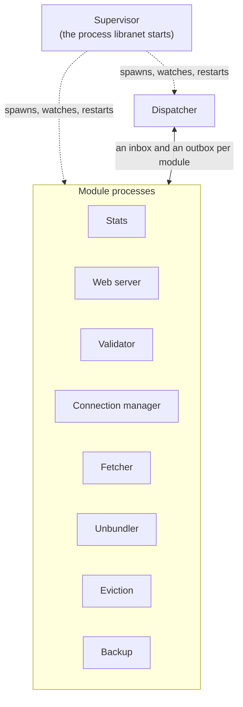

Three rules shape the rest:

- **Modules never call each other.** They share no memory and hold no
  references to one another. What one module needs another to know travels
  as a message through the dispatcher, or as a file on disk that a message
  points at. Nor does one import another's code: what two modules share is
  in `libranet/protocol/`, `libranet/messaging/`, or a library package below
  them all, which `tests/test_module_imports.py` checks.
- **Each message goes to the modules that subscribe to it.** The
  dispatcher puts each message into the inbox of every module that
  subscribes to its event, other than the module that published it, and
  puts `shutdown` into every inbox. Each module filters what it receives
  the same way.
- **Each resource has one owner.** Only the stats module opens the SQLite
  database, only the web server listens for HTTP, only the connection
  manager connects to peers, and only the eviction module deletes content
  (§3.3). A module that needs one of these asks its owner, by message.

Processes rather than threads give each module an interpreter of its own.
CPU work in one, such as checking an upload's hash or reassembling a file,
does not hold up the rest, and a crash takes down only the module that
crashed, which the supervisor restarts on its own.

The modules communicate in three ways:

| Channel | Carries | See |
| --- | --- | --- |
| The message bus | A small dict per event: notices, requests, and answers | §6, §7, §10 |
| Shared files | Content, uploads, derived lists, and caches, which messages point at | §9.1 |
| Process-control events and signals | Start, ready, and stop | §9.2 |

### 2.1 Where the Code Lives

| File | Holds |
| --- | --- |
| `src/libranet/modules.py` | `ModuleName`, the fixed set of processes, and `SPAWNED_MODULES`, the order they start in |
| `src/libranet/supervisor.py` | `main()`, the node's entry point: config, directories, identity, logging, then the supervisor |
| `src/libranet/supervision/process_supervisor.py` | `ProcessSupervisor`: spawning, watching, restarting, and stopping every child |
| `src/libranet/supervision/children.py` | What runs first inside each child: signal handling, logging, and crash reporting |
| `src/libranet/supervision/specs.py` | `ModuleSpec`, and the `ModuleFactory` and `DispatcherEntry` signatures |
| `src/libranet/supervision/registry.py` | Which factory builds each module, and which events it subscribes to |
| `src/libranet/messaging/events.py` | `EventType`: every event on the bus, each noting its publishers and subscribers |
| `src/libranet/messaging/envelope.py` | Building and validating message dicts |
| `src/libranet/messaging/queues.py` | `ModuleQueues`, a module's inbox, outbox, and subscriptions, and the `MessageQueue` protocol |
| `src/libranet/messaging/module.py` | `ModuleBase`: publishing, filtering, and the receive loop |
| `src/libranet/messaging/dispatcher.py` | `Dispatcher`: the hub that delivers each message to its subscribers |
| `src/libranet/messaging/publishing.py` | `Publish`, the signature of `publish` that code outside a module class is handed |
| `src/libranet/protocol/` | What nodes say to one another over HTTP, shared by the modules that do: HTTP syntax, node and seek lists, search, `localhost` resolution, and `/config` requests |
| `src/libranet/{module}/module.py` | Each module's class and factory |

## 3. The Modules

### 3.1 At a Glance

`ModuleName` names ten processes. The supervisor is the parent of the other
nine and is not on the bus. The dispatcher is the bus. The other eight are
modules proper: each subclasses `ModuleBase` and talks to the others only
through the dispatcher.

| Start | Process | `ModuleName` | Class | Job |
| --- | --- | --- | --- | --- |
| — | Supervisor | `supervisor` | `ProcessSupervisor` | Starts, restarts, and stops every other process |
| 1 | Dispatcher | `dispatcher` | `Dispatcher` | Puts each published message into the inbox of every module that subscribes to it |
| 2 | Stats | `stats` | `StatsModule` | Records what the node sees; derives the node, seek, and candidate lists; ranks content for eviction |
| 3 | Web server | `webserver` | `WebServerModule` | Serves the HTTP API, applications, and `/config`, and reports what it was asked |
| 4 | Validator | `validator` | `ValidatorModule` | Checks uploads against their content ids and promotes them into `cas/data` |
| 5 | Connection manager | `connections` | `ConnectionsModule` | Keeps the peer mix; fetches from, pushes to, and hands content off to peers |
| 6 | Fetcher | `fetcher` | `FetcherModule` | Turns a local miss into one request to the connection manager |
| 7 | Unbundler | `unbundler` | `UnbundlerModule` | Resolves application files' entries from their bundles on demand, and deletes unused ones |
| 8 | Eviction | `eviction` | `EvictionModule` | Keeps storage within its limits |
| 9 | Backup | `backup` | `BackupModule` | Backs directories up as bundles; restores, builds, and exports bundles |

The supervisor launches them in this order, taken from `SPAWNED_MODULES`,
but waits only for the dispatcher to be ready. No module waits for another
to start: a message published before its subscriber is running waits in
that subscriber's inbox.

### 3.2 What Each Module Does

#### 3.2.1 Stats

The node's memory, and the only process that opens `libranet.sqlite3`. It
subscribes to 18 of the 40 events, nearly everything the other modules
report, and records each in one small statement. Every
`stats.derive_interval_seconds` it rewrites the node, seek, and candidate
lists into `lists/`, which the web server and connection manager read as
plain files, and publishes `nodes.updated` when the candidate list changed.
It answers two questions from the eviction module: which content to let go
of first (`eviction.candidates`), and which bundles' resolved files to keep
(`resolved.reclaim`). It also adds identifiers it knows of to cached search
results.

#### 3.2.2 Web Server

The node's HTTP listeners: one on the main port, for peers, local clients,
and applications, and one for `/config` alone, at `127.0.0.1` on a port of
its own, so that no application's page shares its origin (Phase 2 Step 58).
That port is `network.config_port`, or else the first free of the main port
plus 100, plus 200, and so on. Each HTTP server runs on a thread of its own
with a thread per request, while the module's main thread runs the receive
loop. Handlers answer from what
is on disk, such as content, derived lists, and resolved entries, and publish
what happened. When an answer depends on work elsewhere, they answer `503`
with `Retry-After` and publish a request, and the client's retry finds the
result (§9.3). The one exception is an application file, whose request
waits, for up to `network.app_wait_seconds`, for the unbundler's answer and
the file's first part, since a `<video>` does not retry a `503` (§8.3). A
bundle a local client makes (`POST /data/bundles`, Phase 3 Step 72) waits
alike for the bundles it reads, and each object of it is written to this
node's own store in `incoming/`, so that it reaches `cas/data` through the
validator, as an upload does. It
also keeps count of the peers connected to it, whose keys the eviction
module keeps.
It subscribes to only three events, `app.path_resolved`, `backup.state`,
and `peers.connected_requested`, and publishes sixteen.

#### 3.2.3 Validator

Single-threaded and stateless. For each `data.put_completed` it reads the
upload from the sender's store in `incoming/`, checks it against its
content id, writes it into `cas/data` if it matches, and deletes the upload
either way, publishing `data.stored` or `data.rejected`. It is the only way
content from a peer enters `cas/data`, with one exception: a peer's own
public key, which the web server and connection manager check and store
themselves.

#### 3.2.4 Connection Manager

Owns every outgoing connection. It keeps up the peer mix (HighLevelDesign
§4.6), dialing again whenever the candidate list changes (`nodes.updated`)
or a connection opens, fails, or closes. It searches connected peers for
content the fetcher asks for (`fetch.requested`), pushes new content to the
best-matching peer (`data.stored`), in pipelined batches when it arrives
faster than it can be sent, and offers content the eviction module wants to
delete to peers until enough accept it (`eviction.notice`).
Content it fetches goes into the peer's store in `incoming/` and is
announced with `data.put_completed`, so it passes through the validator
just as an upload does. It is the most threaded module (§5.4). It reports
every connection event to stats, and names the peers it is connected to
for the eviction module whenever they change (`peers.connected`).

#### 3.2.5 Fetcher

Small and single-threaded. Each `data.not_found` for content the node does
not hold becomes one `fetch.requested`, at most once per content id every
`network.retry_after_seconds`, so a burst of misses for one object asks the
peers once. It opens no connections and writes no content, and only logs
`fetch.succeeded` and `fetch.failed`.

#### 3.2.6 Unbundler

Resolves application files one requested path at a time. For each
`app.path_not_found` it loads the bundle, looks up the path, saves the
file's entry, which names its parts, into `cas/resolved/`, and reports the
outcome with `app.path_resolved`. It reads none of the file's parts: the web
server serves the file from them. A bundle or extension the node lacks is
asked for with `data.not_found`, and the path waits on it, for as long as a
request for it waits: the `data.stored` that says it has arrived resolves
the path again. On `resolved.reclaim` it deletes the
resolved entries of every bundle that stats did not name to keep, and
answers with `resolved.reclaimed`. The directories of recently used bundles
are kept in memory.

#### 3.2.7 Eviction

Keeps storage within `storage.max_storage_bytes` and
`storage.min_free_bytes`, checking after each `data.stored`. When free
space runs short, it first asks for the resolved files of applications not
used lately to be deleted. Then it asks stats which content to let go of,
asks the connection manager to hand each object off to one peer, and
deletes its copy once a peer has accepted it, reporting `data.deleted`. It
never lets go of this node's own public key, nor the key of a peer
connected either way, which the connection manager and web server name in
`peers.connected`. Every question it asks another module has a timeout,
so a restart of the module it asked cannot stall it. It says whether
storage is full, in `storage.full`, so that a backup or build waits rather
than take the node past a limit, and it starts a batch of hand-offs short
of each limit, so that what waits is not slowed to one hand-off at a time.

#### 3.2.8 Backup

Does the `/config` work that takes time: backing up directories, and
restoring, building, and exporting bundles. The web server publishes each
request and answers at once, and the backup module works through them one
at a time on its main thread, between messages. It publishes its whole
state as `backup.state` whenever that changes. Every object it stores is
announced with `data.stored`, as the validator announces what it stores,
and content a restore or export lacks is asked for with `data.not_found`.
Before each object it stores, it looks at its inbox for `storage.full`, and
waits while storage is full, setting other messages aside until it is done.
Jobs are kept in `backup_jobs.json`, and each job's last bundle, kept
expanded, in `backup_jobs/`; restores, builds, and exports are kept in
memory only.

### 3.3 What Each Module Owns

| Resource | Owner | How other modules use it |
| --- | --- | --- |
| The SQLite database | Stats | Publish the events it records; read the lists it derives |
| Derived lists in `lists/` | Stats | The web server and connection manager read them |
| The listening socket | Web server | — |
| Connections to peers | Connection manager | Publish `fetch.requested`, `eviction.notice`, or `data.stored` |
| Promoting peer content into `cas/data` | Validator | Write to `incoming/`, then publish `data.put_completed` |
| Deleting from `cas/data` | Eviction | — |
| Resolved entries in `cas/resolved/` | Unbundler | The web server serves files from them, and deletes one it cannot read; others publish `app.path_not_found` or `resolved.reclaim` |
| The application registry | Web server | — |
| Backup jobs and the backup secret | Backup | The web server publishes `backup.*` requests |
| The search cache in `search/` | Web server | Stats rewrites a cached result to add identifiers |

Adding to `cas/data` is shared more widely than promoting into it: the
validator, the backup module, the web server and connection manager (for
peers' public keys only), and the supervisor (for this node's own public
key) all write there. Every module reads from it.

## 4. Process Lifecycle

### 4.1 Starting a Node

`libranet` runs `supervisor.main()`, which does the work that must happen
once, before any module exists, and exits with status 2 if any of it fails:

1. Parse the command line, and load and validate the config file into a
   `LibranetConfig`.
2. Create the node's directories.
3. Set up the supervisor's own log, so what follows is logged.
4. Load the node's private key, creating it on the first start, and store
   the public key in `cas/data`.
5. Open every content archive once, so a broken one stops the node rather
   than a module.
6. Hand over to `ProcessSupervisor.run()`.

The supervisor creates every module's inbox and outbox before it starts any
process, so the queues outlive any one child. It starts the dispatcher,
waits up to 30 seconds for it to report that it is ready, and then starts
every module. Each child installs its own signal handling, opens its own
log file, `libranet-{module}.log`, builds its module with its factory, and
calls `run()`.

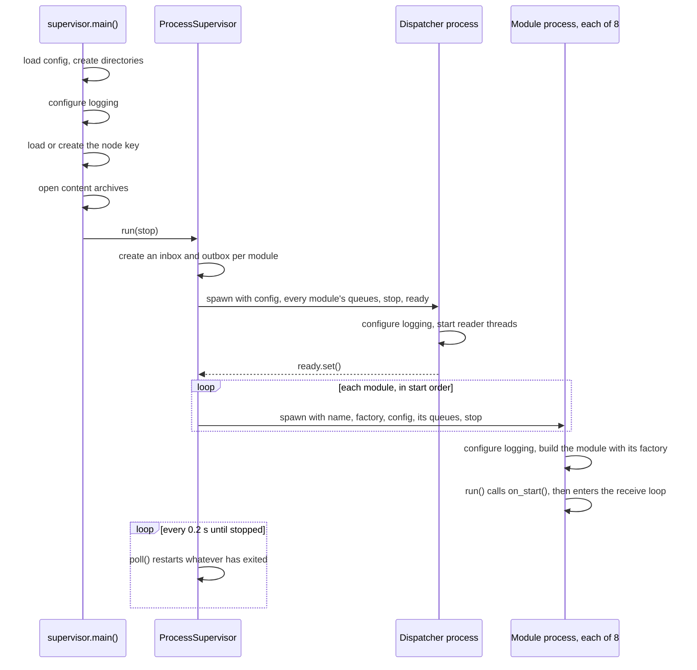

### 4.2 What Crosses the Process Boundary

Children are started with the `spawn` method on every platform, so each is
a fresh interpreter that receives its arguments pickled. That is why a
`ModuleFactory` must be a module-level function, or a `functools.partial`
of one, and never a lambda or nested function.

| Passed to | Argument | Type |
| --- | --- | --- |
| Each module | Its name | `ModuleName` |
| Each module | Its factory | `ModuleFactory` |
| Each module | The validated configuration | `LibranetConfig` |
| Each module | Its inbox and outbox, and the events it subscribes to | `ModuleQueues` |
| Each module | The modules' stop event | `multiprocessing.Event` |
| Dispatcher | Its entry point | `DispatcherEntry` |
| Dispatcher | The configuration | `LibranetConfig` |
| Dispatcher | Every module's queues, and the events each subscribes to | `Mapping[ModuleName, ModuleQueues]` |
| Dispatcher | Its own stop event, and a ready event | `multiprocessing.Event` |

What is not passed matters as much:

- **The YAML file is never read again.** Each child gets the validated
  configuration object as it is.
- **The private key never crosses.** A module that signs or needs the node
  id (the web server, stats, connection manager, eviction, and backup
  modules) reads it from the key directory in `on_start`. The `/config`
  credential and the backup secret are read from disk the same way.
- **Nothing else is shared.** No module object, open file, database
  connection, or socket passes between processes.

### 4.3 Restarts

Any child that exits while the node is running is restarted, however it
exited and however often.

| | Dispatcher | Modules |
| --- | --- | --- |
| Restarted | At once, ahead of anything else | After a backoff delay |
| Delay | None | 0.5 s, doubling with each exit in a row, at most 30 s |
| Backoff resets | — | When the module had stayed up for 60 s |
| While it is down | No module is started or restarted | Messages for it wait in its inbox, and in the dispatcher once that is full |

| Exits in a row | 1 | 2 | 3 | 4 | 5 | 6 | 7 or more |
| --- | --- | --- | --- | --- | --- | --- | --- |
| Delay before restarting | 0.5 s | 1 s | 2 s | 4 s | 8 s | 16 s | 30 s |

Because the supervisor creates and holds every queue, a restarted module
picks up where its inbox left off: messages published while it was down
are waiting for it. What it loses is what it held in memory, and the
message it was handling if it died mid-message. §10.2 describes how each
module recovers.

A module crashes, and so exits with status 1, when an exception escapes its
factory, `on_start`, `on_idle`, or `on_stop`. An exception from `handle` is
only logged (§5.2).

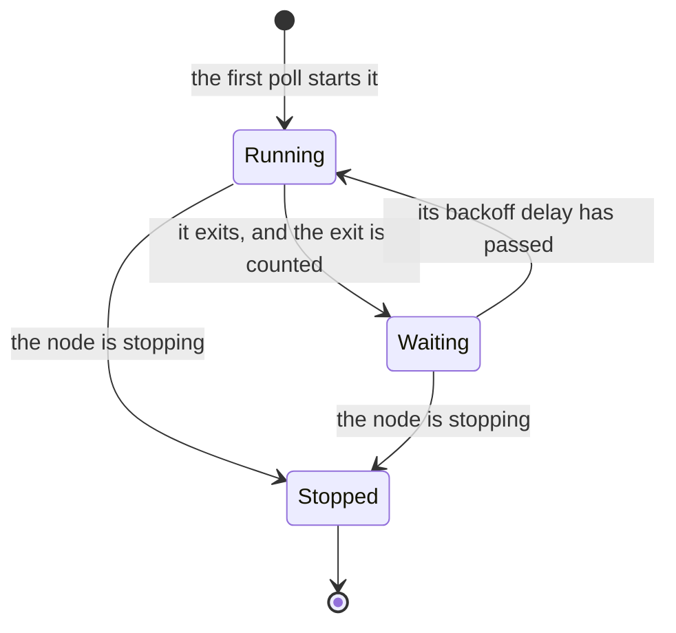

### 4.4 Stopping

`SIGINT` or `SIGTERM` sent to the supervisor sets an event that its run
loop checks on every poll. The loop then calls `shutdown()`, which stops
the modules first and the dispatcher last:

1. It sets the modules' stop event. Each module's receive loop sees it
   within a poll interval of finishing the message it is on, leaves the
   loop, and runs `on_stop`: the web server closes its socket, the
   connection manager closes its connections, and stats closes the
   database.
2. It waits up to 5 seconds for the modules. Any still running is sent
   `SIGTERM` and given 5 seconds more, and then `SIGKILL`.
3. Once every module has exited, it sets the dispatcher's stop event and
   stops the dispatcher the same way.

The dispatcher goes last because a module cannot finish exiting until what
it published on its way out has been read from its outbox. The connection
manager, for one, reports every connection it closes as it stops.

A child ignores `SIGINT`: a Ctrl-C in a terminal reaches every process in
the group, and it is the supervisor that decides the order they stop in. A
child turns `SIGTERM` into `SystemExit`, so a module blocked reading its
inbox unwinds and releases the queue's lock. A process killed while holding
that lock would leave its replacement unable to read from the queue.

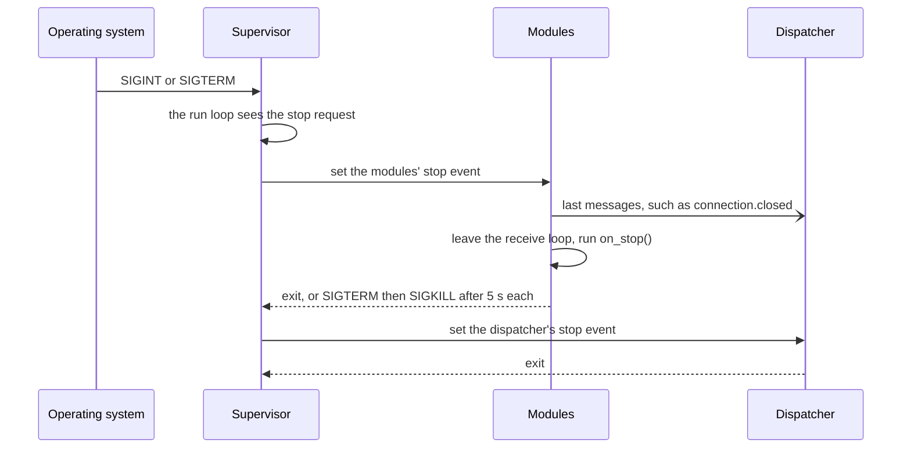

### 4.5 Timing

These are constructor defaults, not configuration settings.

| Timing | Default | Defined in |
| --- | --- | --- |
| Supervisor poll interval | 0.2 s | `supervision/process_supervisor.py` |
| First restart delay | 0.5 s | `supervision/process_supervisor.py` |
| Longest restart delay | 30 s | `supervision/process_supervisor.py` |
| Uptime that resets the backoff | 60 s | `supervision/process_supervisor.py` |
| Dispatcher ready timeout | 30 s | `supervision/process_supervisor.py` |
| Each stop stage: asked, `SIGTERM`, `SIGKILL` | 5 s | `supervision/process_supervisor.py` |
| Dispatcher poll interval | 0.1 s | `messaging/dispatcher.py` |
| Module poll interval, and so the `on_idle` cadence | 0.5 s | `messaging/module.py` |

## 5. Inside a Module

### 5.1 The Receive Loop

`ModuleBase.run()` is every module's main loop. A module supplies the hooks
and `handle`; the base class supplies the rest.

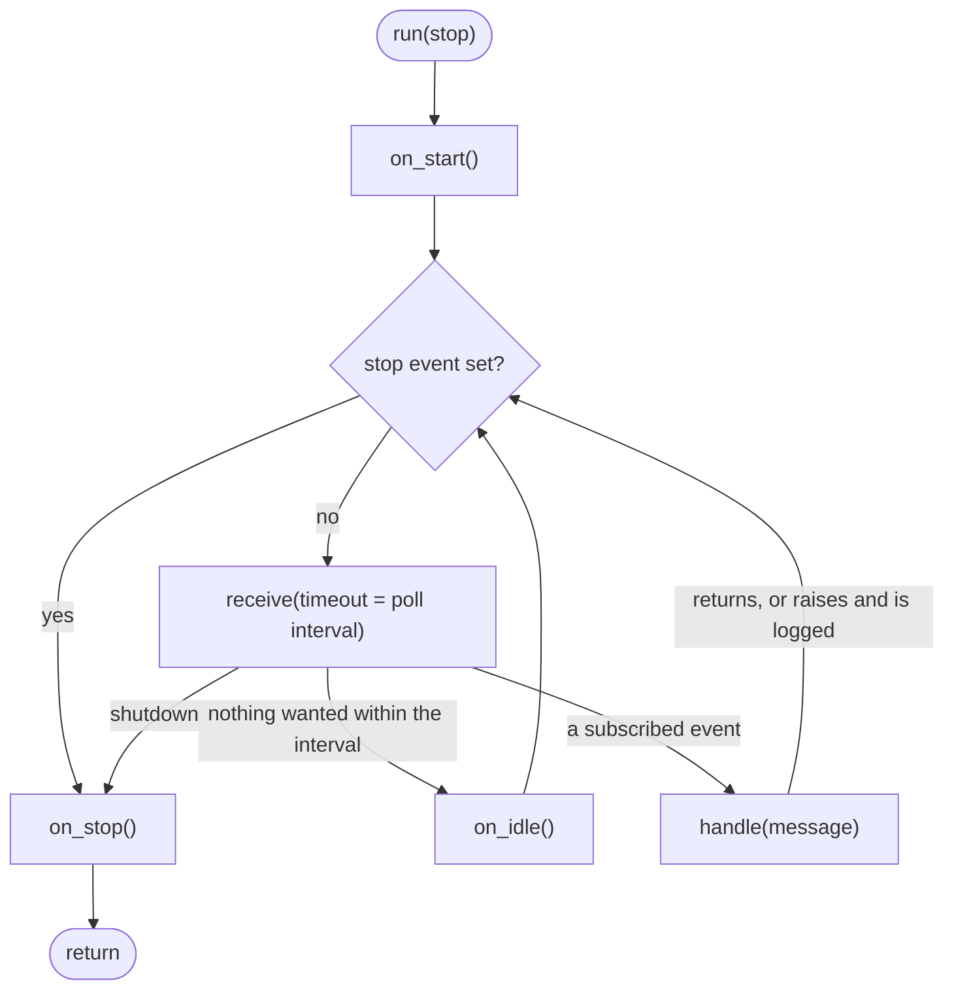

`receive()` discards, while it waits, every message the module does not
want: malformed ones, which it logs, its own, and events outside its
`subscriptions`. The dispatcher delivers neither of the last two (§6.1), so
those reach a module only when a test puts them in its inbox.

`on_idle` runs only when a whole poll interval passes without a message the
module wants. A module sent one at least every half second never idles, and
the work it does in `on_idle` waits until traffic pauses. That work
includes stats deriving its lists, eviction giving up on unanswered
requests, and the connection manager dialing peers again and refreshing
their seek lists.

### 5.2 The Hooks

| Hook | Runs | If it raises |
| --- | --- | --- |
| `on_start()` | Once, before the loop | The module crashes and is restarted |
| `handle(message)` | For each message the module subscribes to | The exception is logged, and the loop carries on |
| `on_idle()` | After a poll interval with nothing to handle | The module crashes and is restarted |
| `on_stop()` | Once, after the loop, however it ended | The module exits with status 1 |

What each module does in them:

| Module | `on_start` | `on_idle` | `on_stop` |
| --- | --- | --- | --- |
| Stats | Read the node id; open the database; derive the lists | Derive the lists once the interval has passed | Close the database |
| Web server | Name no peers connected; read the key and credential; bind; start the HTTP thread | — | Stop the HTTP server; close the socket |
| Validator | — | — | — |
| Connection manager | Read the key; name no peers connected; start the workers; load candidates; dial | Dial rested candidates; refresh peers due; resume searches due a next pass | Stop the workers; close every connection |
| Fetcher | — | — | — |
| Unbundler | — | — | — |
| Eviction | Read the node id; count storage; ask which peers are connected; say whether storage is full; evict if over | Say whether storage is full, if that changed; time out hand-offs and questions; resume after a pause | — |
| Backup | Read the node id; ask whether storage is full; read the jobs; report state | Carry on the next restore, build, export, or backup due | — |

### 5.3 Writing a Module

A module is a `ModuleBase` subclass that declares its subscriptions and
handles them, and a factory the supervisor calls inside the new process.
Every module's constructor takes its name, its queues, and the node's
configuration, then, by keyword, the `logger`, `clock`, and
`poll_interval_seconds` it passes to `ModuleBase`, and after them anything
a test may replace. Every module gives `_route` a handler for each event it
subscribes to, and the inherited `handle` passes each message to its
event's handler. `_route` refuses a table that misses a subscription or
names an event not subscribed to, and `handle` raises for an event with no
handler rather than taking it for another:

```Python
class ExampleModule(ModuleBase):
    """What this module is for, and the payloads it publishes and consumes."""

    subscriptions: ClassVar[frozenset[EventType]] = frozenset({EventType.DATA_STORED})

    def __init__(
        self,
        name: ModuleName,
        queues: ModuleQueues,
        config: LibranetConfig,
        *,
        logger: Logger | None = None,
        clock: Callable[[], float] = time,
        poll_interval_seconds: float = DEFAULT_POLL_INTERVAL_SECONDS,
    ) -> None:
        super().__init__(
            name, queues, logger=logger, clock=clock, poll_interval_seconds=poll_interval_seconds
        )
        self._config = config
        self._route({EventType.DATA_STORED: self._on_data_stored})

    def _on_data_stored(self, message: Message) -> None:
        self.logger.info("%s was stored", ContentId.from_fields(message))


def example_module_factory(
    name: ModuleName, config: LibranetConfig, queues: ModuleQueues
) -> ModuleBase:
    """ModuleFactory for ExampleModule, called inside the module's own process."""
    return ExampleModule(name, queues, config)
```

To add a module to the node:

1. Add a member to `ModuleName`, and put it in `SPAWNED_MODULES` where it
   should start.
2. Write the class and its factory in `src/libranet/{area}/module.py`.
3. Map the name to the factory and the class in `_MODULES` in
   `supervision/registry.py`. Every spawned module but the dispatcher needs
   one there: without it, `default_module_specs` raises `KeyError`, and the
   node does not start. The class's `subscriptions` are what the
   dispatcher delivers to the module.

To add an event:

1. Add a member to `EventType`, with a comment naming who publishes it and
   who subscribes.
2. Describe its payload in the publishing module's docstring.
3. Add it to each subscriber's `subscriptions` and the table it gives
   `_route`.

A payload holds only plain JSON values. A content id travels as an
`algorithm` and `hash` pair, or as a `sha256/{hex}` string, and a payload
may not use an envelope field's name (§6.2).

A module logs with `self.logger`. Code with no logger at hand, such as the
bundle library or a web handler, uses `getLogger(__name__)`, whose records
reach the process's own log file through the `libranet` logger. Every
caught exception is logged, or raised on, or its handler has a comment
starting `# Not logged:` that says why: the exception is how the code asks a
question, or the code it is handed to logs it. A failure the caller turns
into a `4xx` response or a value it reports is logged at debug. Data that is
not what it should be is always logged: at warning when it is this node's
own, at debug when a client or peer sent it and it was refused. An id under
a hash algorithm this node does not support is a warning wherever it is met,
since the node may need an update, and `UnsupportedAlgorithms` logs a whole
archive's or list's worth once. `tests/test_exception_logging.py` checks
every handler.

A constant another module also needs is defined once, public, in the
lowest module of the layer its meaning belongs to — bundle path syntax in
`bundle/shapes.py`, HTTP syntax in `protocol/http_syntax.py` — and imported
from there, even where the same value could be written inline. Compact
JSON, which no layer owns, is in `json_format.py`. Constants that only share
a value stay apart: a protected bundle's compression level may never
change, and the level objects are stored at may.

### 5.4 Threads Inside a Module

Six of the eight modules are single-threaded. The other two are not:

| Module | Threads besides the main one | Their shared state is guarded by |
| --- | --- | --- |
| Web server | The HTTP server's thread; one thread per request | A lock in each shared object (§9.3) |
| Connection manager | 8 fetch workers; 8 push workers; a reverse-DNS worker; a thread per dial, refresh, and hand-off | One lock for the whole module |

Any thread may publish: `publish()` only puts the message on the outbox,
and `multiprocessing.Queue.put` is thread-safe. Only the main thread
receives.

A single-threaded module does its work inside `handle` or `on_idle`, so
long work holds up its other messages. A backup of a large directory, for
one, runs to the end before the backup module handles its next message.
It does look at its inbox before each object it stores, for whether storage
is full, and sets everything else aside until it is done (Phase 2 Step 63).
Its inbox fills meanwhile only with what it subscribes to, and what will
not fit waits in the dispatcher (§6.3), so the rest of the node carries on.

## 6. The Message Bus

### 6.1 How a Message Travels

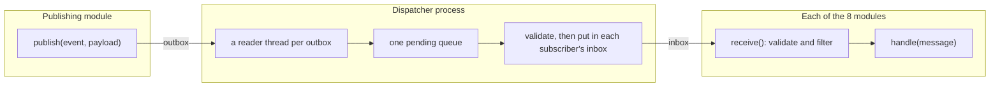

1. `publish()` wraps the payload in an envelope (`make_message`) and puts
   the dict on the module's outbox. It returns at once, and the publisher
   never learns who received the message.
2. In the dispatcher, a reader thread per outbox moves each message onto
   one local queue, because a `multiprocessing.Queue` cannot be waited on
   alongside others.
3. The dispatcher's main thread validates the envelope and puts the
   message into the inbox of every module that subscribes to its event, or
   into every inbox if it is `shutdown`, but never into its publisher's own.
   A full inbox holds up no other: what it cannot take is held, in order,
   and put in as the module reads (§6.3).
4. In each module, `receive()` validates the envelope again, and keeps the
   message only if another module published it and it is either
   `shutdown` or an event the module subscribes to. Every message the
   dispatcher delivers passes; the check guards what a test puts straight
   into an inbox.

### 6.2 The Envelope

A message is a plain `dict`, so it pickles cheaply and reads as JSON. Three
fields make up the envelope, and everything else is the event's payload:

```json
{
  "event": "data.stored",
  "timestamp": 1790465751.3,
  "source": "validator",
  "algorithm": "sha256",
  "hash": "0123abcd…",
  "node_id": "sha256/89ef01…",
  "size": 4096
}
```

| Field | Holds | Checked |
| --- | --- | --- |
| `event` | An `EventType` value | Must name a known event |
| `timestamp` | When it was published, in seconds since the epoch | Must be a finite number |
| `source` | The publisher's `ModuleName` value | Must name a known module |
| Any other | The event's payload | Only by the subscriber that reads it |

The fetcher uses `timestamp` to time a miss from when it was reported
rather than when it was handled, so a backlog cannot make a client's retry
look early.

### 6.3 Delivery

| Property | Behavior |
| --- | --- |
| Routing | By subscription: each message goes to the inbox of every module whose `ModuleQueues.subscriptions` include its event, and `shutdown` to every inbox. The receiver filters again |
| A module's own messages | Never delivered back to it: the dispatcher skips the publisher's inbox. The backup module both publishes and subscribes to `data.stored`, and sees only other modules' |
| Order | Messages from one module arrive in the order it published them; there is no order between modules |
| Delivery | At most once, held in memory only |
| A module restarts | Messages waiting in its inbox survive; one it was handling is lost |
| The node restarts | Every message in every queue is lost |
| A malformed message | Logged and dropped by the dispatcher, and again by the receiver |
| A handler raises | The exception is logged, and the module carries on with its next message |
| Capacity | A `multiprocessing.Queue` holds at most `SEM_VALUE_MAX` unread messages, 32,767 on macOS, and a `put` past that waits. The dispatcher never waits: what a full inbox cannot take is held in its memory, without limit, and put in as the module reads. The inbox filling is logged as a warning, and what was held at info once it is all delivered. Nothing tells publishers to slow down (Phase 2 Step 61) |
| Cost | Each message is pickled into the outbox, and again into the inbox of each module it is delivered to |
| Replies | None built in: no request ids, and no reply-to address (§10.1) |

### 6.4 The `shutdown` Event

`EventType.SHUTDOWN` stops the dispatcher and every module's receive loop
when it is broadcast, but nothing in a running node publishes it. The
supervisor has no outbox, and stops its children with the stop events of
§9.2 instead. Tests put a `shutdown` message straight into a module's inbox
to end its loop.

## 7. Event Catalog

### 7.1 Who Publishes and Who Subscribes

**P** publishes the event and **S** subscribes to it. Rows are grouped as
`EventType` groups them.

| Event | Web server | Connections | Validator | Stats | Fetcher | Unbundler | Eviction | Backup |
| --- | :-: | :-: | :-: | :-: | :-: | :-: | :-: | :-: |
| *Reading* | | | | | | | | |
| `data.requested` | P | | | S | | | | |
| `data.not_found` | P | | | S | S | P | | P |
| `data.search_requested` | P | | | S | | | | |
| *Writing and validation* | | | | | | | | |
| `data.put_completed` | P | P | S | | | | | |
| `data.stored` | P | P S | P | S | | S | S | P S |
| `data.rejected` | | | P | S | | | | |
| *Peers and their lists* | | | | | | | | |
| `nodes.received` | P | P S | | S | | | | |
| `seek.received` | P | | | S | | | | |
| `nodes.updated` | | S | | P | | | | |
| `address.verified` | | P | | S | | | | |
| *Connections and fetching* | | | | | | | | |
| `connection.opened` | | P | | S | | | | |
| `connection.closed` | | P | | S | | | | |
| `connection.failed` | | P | | S | | | | |
| `node.unreached` | | P | | S | | | | |
| `data.sent` | | P | | S | | | | |
| `fetch.requested` | | S | | | P | | | |
| `fetch.attempted` | | P | | S | | | | |
| `fetch.succeeded` | | P | | | S | | | |
| `fetch.failed` | | P | | | S | | | |
| *Applications* | | | | | | | | |
| `app.path_not_found` | P | | | | | S | | |
| `app.path_resolved` | S | | | | | P | | |
| *`/config` and backup* | | | | | | | | |
| `backup.job_configured` | P | | | | | | | S |
| `backup.job_removed` | P | | | | | | | S |
| `backup.run_requested` | P | | | | | | | S |
| `backup.restore_requested` | P | | | | | | | S |
| `backup.build_requested` | P | | | | | | | S |
| `backup.export_requested` | P | | | | | | | S |
| `backup.state` | S | | | | | | | P |
| *Eviction* | | | | | | | | |
| `eviction.notice` | | S | | | | | P | |
| `eviction.acknowledged` | | P | | | | | S | |
| `data.deleted` | | | | S | | | P | |
| `eviction.candidates_requested` | | | | S | | | P | |
| `eviction.candidates` | | | | P | | | S | |
| *Reclaiming resolved files* | | | | | | | | |
| `app.accessed` | P | | | S | | | | |
| `resolved.reclaim_requested` | | | | S | | | P | |
| `resolved.reclaim` | | | | P | | S | | |
| `resolved.reclaimed` | | | | | | P | S | |
| *Connected peers* | | | | | | | | |
| `peers.connected_requested` | S | S | | | | | P | |
| `peers.connected` | P | P | | | | | S | |
| *Storage full* | | | | | | | | |
| `storage.full_requested` | | | | | | | S | P |
| `storage.full` | | | | | | | P | S |
| *Lifecycle* | | | | | | | | |
| `shutdown` | S | S | S | S | S | S | S | S |
| **Publishes / subscribes** | 16 / 3 | 14 / 6 | 2 / 1 | 3 / 18 | 1 / 3 | 3 / 3 | 6 / 6 | 4 / 8 |

The `shutdown` row and its subscriptions are implicit: every module
receives it without listing it, and nothing publishes it (§6.4). The totals
leave it out.

### 7.2 Payloads

A content id is an `algorithm` and a lower-case hex `hash`, or, in
`node_id`, `bundle`, and lists of ids, one string such as `sha256/{hex}`.

| Event | Payload | Meaning |
| --- | --- | --- |
| `data.requested` | `algorithm`, `hash`, `external` | `GET /data` asked for this content, held or not; `external` is false for a request from this machine |
| `data.not_found` | `algorithm`, `hash` | Content was needed that this node does not hold |
| `data.search_requested` | `prefix` | A search was answered, and its result cached in `search/` |
| `data.put_completed` | `algorithm`, `hash`, `node_id` | Unchecked bytes wait in `node_id`'s store in `incoming/` |
| `data.stored` | `algorithm`, `hash`, `node_id`, `size` | New content is in `cas/data`; `node_id` is where it came from, this node for its own |
| `data.rejected` | `algorithm`, `hash`, `node_id` | An upload did not match its content id |
| `nodes.received` | `nodes`: endpoint → node id; `sources`: endpoint → `AddressSource` | Addresses learned, and how |
| `seek.received` | `node_id`, `data`, `search` | A peer's seek list |
| `nodes.updated` | — | The candidate list, `lists/candidates.json`, changed |
| `address.verified` | `node_id`, `endpoint` | The endpoint reached a node already connected at another |
| `connection.opened` | `node_id`, `endpoint` | A peer proved its node id |
| `connection.closed` | `node_id`, `remote` | A connection closed; `remote` is false if this node closed it |
| `connection.failed` | `node_id`, `endpoint` | Dialing the endpoint did not reach the node expected there |
| `node.unreached` | `node_id` | Every endpoint the node was dialed at failed |
| `data.sent` | `algorithm`, `hash`, `node_id`, `size` | Content was pushed to a peer |
| `fetch.requested` | `algorithm`, `hash` | Search the connected peers for this content |
| `fetch.attempted` | `algorithm`, `hash`, `node_id`, `found` | One peer was asked for it |
| `fetch.succeeded` | `algorithm`, `hash`, `node_id` | `node_id` sent it, and it is on its way to the validator |
| `fetch.failed` | `algorithm`, `hash` | The search ended without it |
| `app.path_not_found` | `bundle`, `path` | No entry is saved for the file at `path` in `bundle` |
| `app.path_resolved` | `bundle`, `path`, `outcome`, and `location` or `detail` | `outcome` is `stored`, `not_found`, `redirect`, `unusable`, or `protected` |
| `backup.job_configured` | `job_id`, `directory`, `interval_seconds` | Keep this directory backed up |
| `backup.job_removed` | `job_id` | Stop backing it up |
| `backup.run_requested` | `job_id` | Back it up now |
| `backup.restore_requested` | `restore_id`, `bundle`, `directory`, `on_conflict` | Restore a bundle into a directory |
| `backup.build_requested` | `build_id`, `directory`, `password` | Build a directory into a bundle; `password` is never logged |
| `backup.export_requested` | `export_id`, `bundle`, `archive`, `on_conflict`, `password` | Write a bundle into a content archive |
| `backup.state` | `jobs`, `restores`, `builds`, `exports` | Everything the backup module is doing, replacing the last report |
| `eviction.notice` | `algorithm`, `hash`, `copies` | Hand this content off to `copies` peers |
| `eviction.acknowledged` | `algorithm`, `hash`, `node_ids` | The peers that accepted it, best match first |
| `data.deleted` | `algorithm`, `hash`, `size` | Content was deleted from `cas/data` |
| `eviction.candidates_requested` | `bytes`, `exclude` | Name enough content to free `bytes`, leaving out `exclude` |
| `eviction.candidates` | `objects`: a list of `algorithm`, `hash`, `size` | Content to let go of, best first |
| `app.accessed` | `bundle` | An application served from `bundle` was used; reported at most hourly per bundle |
| `resolved.reclaim_requested` | — | Free space is short; reclaim resolved files not used lately |
| `resolved.reclaim` | `keep` | Delete every bundle's resolved files except those in `keep` |
| `resolved.reclaimed` | `bundles`, `bytes` | How many bundles' files were deleted, and the bytes freed |
| `peers.connected_requested` | — | Name the peers connected now |
| `peers.connected` | `direction`: `outbound` or `inbound`; `node_ids` | Every peer connected that way, replacing the last list for that direction |
| `storage.full_requested` | — | Say whether storage is full now |
| `storage.full` | `full` | Whether one more object of `storage.max_object_bytes` would take storage past a limit, so that content this node creates waits |
| `shutdown` | — | Leave the receive loop |

### 7.3 Who Talks to Whom

The graph below shows which modules set each other to work. `data.stored`
and `data.not_found` are drawn as nodes of their own, since several modules
publish each and several act on it, and two modules that ask and answer
share one two-way line.

Three kinds of message are left out to keep it legible, and §7.1 lists them
all: the reports only stats records, the copies of `data.stored` and
`data.not_found` that stats also records, and the `data.stored` the web
server and connection manager publish for peers' public keys.

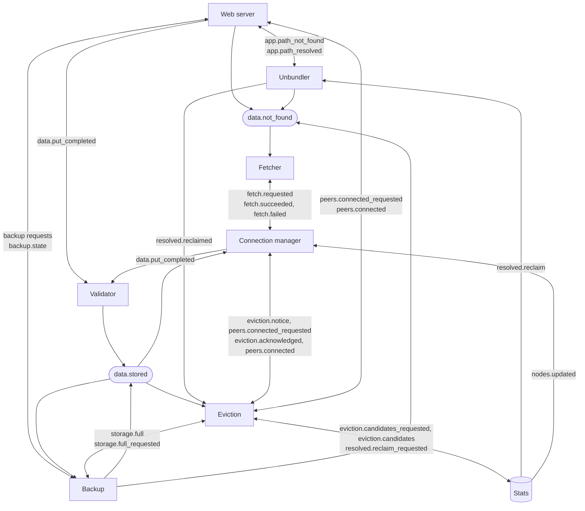

## 8. Walkthroughs

Each diagram follows one piece of work across modules. Solid arrows are
HTTP or work within a process. Open arrowheads are messages on the bus;
each passes through the dispatcher, which is left out.

### 8.1 A Peer Pushes Content

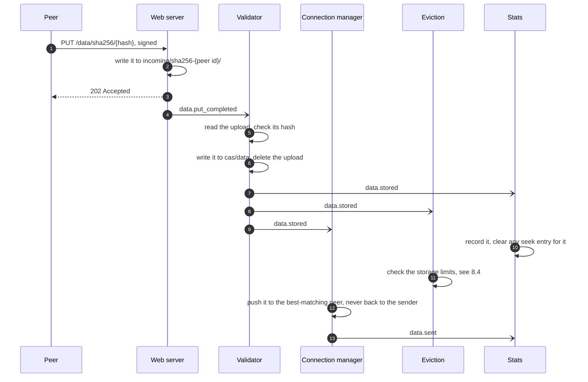

The backup module receives `data.stored` too, and carries on any restore
that was waiting for that content.

### 8.2 A Miss Becomes a Fetch

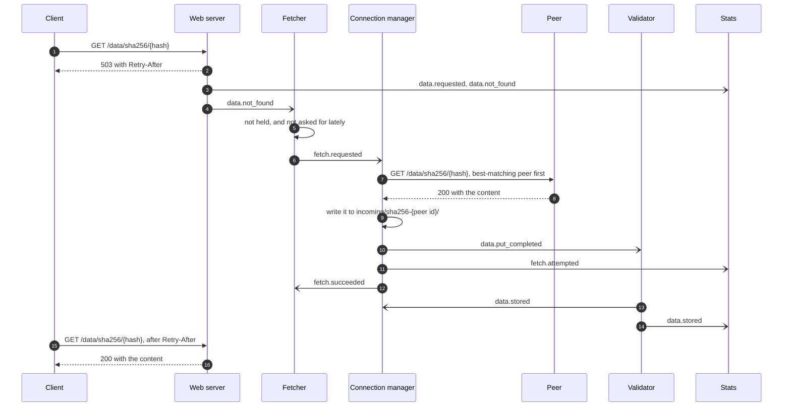

If no connected peer has it, the connection manager publishes
`fetch.failed`, and the content stays in this node's seek list, where peers
that connect later find it. Content that arrives by any route while it is
being searched for ends the search.

### 8.3 Serving an Application File

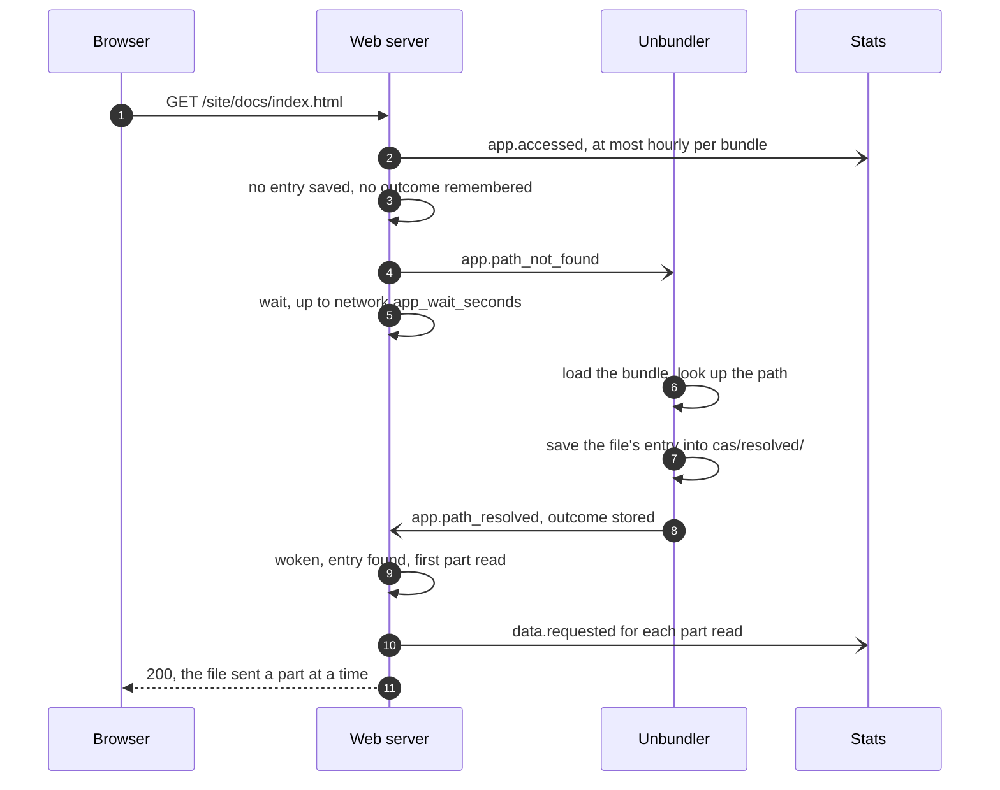

If the bundle is not held, the unbundler publishes `data.not_found` for it,
which starts a fetch (§8.2), and reports no outcome until it arrives: the
`data.stored` that says so has it resolve the path then, which wakes the
waiting request. A part of the file not held is asked for by the
web server, with the few parts after it, and looked for every quarter of a
second. A request for a range of the file reads, and asks for, only the
parts holding it, and a `HEAD` reads none (Phase 3 Step 66). A request
whose entry or first part does not come within
`network.app_wait_seconds` is answered `503`, and one whose later part does
not is cut short. Outcomes other than `stored` leave no entry, so the web
server remembers them and answers the next request for the path at once:
`404` for `not_found`, `302` for `redirect`, and `500` for `unusable`.

### 8.4 Running Short of Space

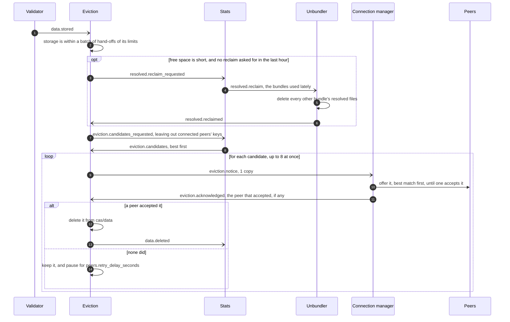

Each question the eviction module asks has a timeout: 60 seconds for the
reclaim and for the candidates, and 1,200 seconds for a hand-off. A module
that restarts mid-conversation therefore costs a delay, never a stall.

Throughout, the eviction module keeps the public keys of this node and of
the peers connected to it either way, since signatures are checked against
them. The connection manager and the web server each name their peers in
`peers.connected` whenever those change, and again when eviction asks, as
it does when it starts. Those keys are left out of what stats is asked for
and never handed off, and one whose peer connects while it is being handed
off is kept.

Content this node creates itself waits rather than take storage past a
limit (HighLevelDesign §4.5, Phase 2 Step 63). Eviction says in
`storage.full` whether one more object of `storage.max_object_bytes` would
pass a limit, whenever that changes, and again when the backup module asks,
as it does when it starts. Before each object a backup or build stores, the
backup module looks at its inbox for it, and while storage is full it waits,
setting other messages aside until it is done. Eviction starts eight
objects' worth short of each limit, so eight hand-offs are under way while
it waits. Storage still full after `backup.storage_stall_seconds` fails the
backup or build.

### 8.5 A `/config` Request

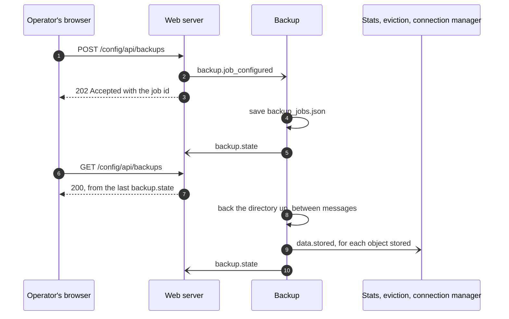

## 9. Communication Outside the Bus

### 9.1 Shared Files

Messages stay small because they name content rather than carry it. Bulk
data moves through files, and a message tells the reader where to look.

| File or directory | Written by | Read by | Announced by |
| --- | --- | --- | --- |
| `incoming/{algorithm}-{node}/` | Web server, for uploads, and for the bundles local clients make, as this node's; connection manager, for fetched content | Validator, which deletes each | `data.put_completed` |
| `cas/data/` | Validator; backup; web server and connection manager, peers' keys only; supervisor, this node's key | Every module | `data.stored` |
| `cas/data/`, deletions | Eviction | — | `data.deleted` |
| `cas/resolved/` | Unbundler; the web server deletes an entry it cannot read | Web server | `app.path_resolved`, `resolved.reclaimed` |
| `lists/candidates.json` | Stats | Connection manager | `nodes.updated` |
| `lists/nodes.json`, `lists/seek.json` | Stats | Web server; connection manager | Nothing; read when needed |
| `search/` | Web server; stats, adding identifiers | Web server | `data.search_requested`, which names the prefix |
| `libranet.sqlite3` | Stats | Stats | — |
| `applications.json` | Web server | Web server | — |
| `backup_jobs.json` | Backup | Backup | — |
| `backup_jobs/` | Backup | Backup | — |
| `keys/` | Supervisor; backup; web server | Modules that need them, in `on_start` | — |

Two things make sharing these safe without locks. Every file is replaced
whole, by renaming a finished temporary file over it (File Layout §8), so a
reader sees the old file or the new one and never part of either. And a
content-addressed file never changes once it is written. File Layout has
the details of each.

### 9.2 Process Control

| Signal | Kind | Set or sent by | Acted on by | Means |
| --- | --- | --- | --- | --- |
| Stop request | `threading.Event` | The supervisor's `SIGINT` and `SIGTERM` handler | The supervisor's run loop | The node is asked to stop |
| Modules' stop | `multiprocessing.Event` | `shutdown()` | Every module's receive loop | Leave the loop |
| Dispatcher's stop | `multiprocessing.Event` | `shutdown()`, once the modules have exited | The dispatcher | Stop delivering |
| Ready | `multiprocessing.Event`, new for each dispatcher start | The dispatcher, once it is running | The supervisor | Modules may start |
| `SIGTERM` | OS signal | The supervisor, once a stop stage times out | A child, which raises `SystemExit` | Unwind and exit |
| `SIGKILL` | OS signal | The supervisor, when `SIGTERM` was ignored | — | Exit now |
| `SIGINT` | OS signal | A terminal's Ctrl-C | Ignored by children | — |

The stop request and the modules' stop event are kept apart, so a signal
meant for the supervisor never reaches a child directly (Phase 1 Step 33).

### 9.3 Request Threads and the Receive Loop

Inside the web server, a request thread publishes a request and answers at
once. The answer arrives later on the module's main thread, which keeps it
in an object that request threads read under a lock, and the client's retry
finds it there. A request for an application file is the exception: it
waits on `ApplicationOutcomes`, for up to `network.app_wait_seconds`, and
each `app.path_resolved` the main thread takes in wakes it (Phase 3 Step
65).

| Shared object | Written from | Read to answer |
| --- | --- | --- |
| `ApplicationOutcomes` | `app.path_resolved`, keeping outcomes `not_found`, `redirect`, and `unusable`, and waking requests waiting on any | Application paths, with `404`, `302`, or `500` |
| `BackupState` | `backup.state` | `GET /config/api/backups`, `restores`, `builds`, and `exports` |

A third, `ApplicationUse`, is shared among request threads only: it
remembers when each bundle's use was last reported, so `app.accessed` goes
out at most once an hour per bundle.

A fourth, `InboundPeers`, is written by request threads and read by the
main thread. A connection counts for a peer from its first request whose
signature that peer's key verifies until the connection closes, and a list
of every peer connected goes out as `peers.connected` whenever one comes
or goes. The main thread reads it only to answer
`peers.connected_requested`.

## 10. How Modules Converse

### 10.1 Patterns

The bus has no request ids and no replies, so modules converse in a few
recurring ways:

| Pattern | How it works | Examples |
| --- | --- | --- |
| Report | Publish and forget; nobody answers | `data.requested`, `connection.opened`, `data.deleted`, `app.accessed` |
| Request keyed by content | The answer names the same content id, or bundle and path, as the request, and repeated requests collapse into one piece of work | `fetch.requested` and `fetch.succeeded`; `app.path_not_found` and `app.path_resolved`; `eviction.notice` and `eviction.acknowledged` |
| One question at a time | The asker keeps one question outstanding, takes the next answer broadcast as its answer, and gives up after a timeout | `eviction.candidates_requested` and `eviction.candidates`; `resolved.reclaim_requested`, `resolved.reclaim`, and `resolved.reclaimed` |
| Whole-state report | Each report carries everything and replaces the one before | `backup.state`; `peers.connected`, a list per direction, also sent when `peers.connected_requested` asks; `storage.full`, also sent when `storage.full_requested` asks |
| Pointer to a file | The message says where the data is: a store it names, or a file every module finds from the configuration | `data.put_completed`, `nodes.updated`, `data.search_requested` |
| Retry over HTTP | The web server answers `503` with `Retry-After` and publishes a request; the client's retry finds the result | A `/data` miss; an application file whose entry or first part does not come within `network.app_wait_seconds` |

Several modules also limit how often they repeat themselves: the fetcher
asks for the same content at most once per `network.retry_after_seconds`,
the web server reports a bundle's use at most hourly, and the connection
manager drops a fetch for content it is already searching for, or found
nothing for within `peers.failed_search_hold_seconds`.

### 10.2 Surviving a Restart

When a module restarts, what it held in memory is gone, while what is on
disk and in its inbox is not. The conversations are built so the other
side recovers:

| Module restarted | What is lost | How the node recovers |
| --- | --- | --- |
| Stats | An answer it owed the eviction module | The database is kept, and the lists are derived again at start; eviction times out and asks again |
| Web server | Remembered outcomes; the last `backup.state`; requests in progress; its connections | Paths are asked of the unbundler again. The `/config/api` backup endpoints answer `503` until the backup module next reports, which it does only when something changes. It names no peers connected as it starts, and peers that dial again are named anew |
| Validator | The upload it was checking, if it died mid-message | The upload stays in `incoming/` until the same content arrives from the same node again |
| Connection manager | Connections, searches, hand-offs, content not yet pushed | It dials from the candidate list again, naming no peers connected until one is; eviction times out a hand-off after 1,200 s; a fetch is asked for again at the next miss after the fetcher's interval |
| Fetcher | Which content it asked for lately | The next miss is asked for at once |
| Unbundler | Directories held in memory; paths waiting on content; a reclaim in progress | Directories are read back from each bundle's saved `directory.jzon`; a request waiting on a path forgotten is answered `503`, and its retry asks again; eviction times out the reclaim |
| Eviction | Hand-offs under way; its list of candidates; which peers are connected | It counts storage again at start, says whether storage is full, asks which peers are connected, and asks stats again |
| Backup | Restores, builds, and exports; messages set aside while it stored content | They must be asked for again; jobs are read back from `backup_jobs.json`; it asks whether storage is full |
| Dispatcher | Messages it had read but not yet delivered, and those it held for a full inbox | Nothing recovers them; no module is started until it is back |

## 11. Testing Modules

A module is given its queues through its constructor, and nothing in
`ModuleBase` starts a process, so a module can be tested in one process
with plain `queue.Queue` objects: put a message in, call `handle` or a
hook, and read what it published from its outbox. Condensed from
`tests/test_validator_module.py`:

```Python
queues = ModuleQueues(inbox=Queue(), outbox=Queue())
validator = ValidatorModule(
    ModuleName.VALIDATOR, queues, LibranetConfig(storage=storage), poll_interval_seconds=0.01
)

CasStore.for_node(storage, NODE_ID).write(CONTENT_ID, CONTENT)  # as the web server would
validator.handle(
    make_message(
        EventType.PUT_COMPLETED,
        ModuleName.WEBSERVER,
        {"algorithm": CONTENT_ID.algorithm, "hash": CONTENT_ID.hash, "node_id": str(NODE_ID)},
    )
)

message = queues.outbox.get(block=False)
assert message["event"] == EventType.DATA_STORED
```

| Level | How | Where |
| --- | --- | --- |
| One module | Queues from `queue.Queue`; call `handle` and the hooks directly, with a fake clock where timing matters | `tests/test_*_module.py` |
| The bus | `Dispatcher.dispatch_pending()`, which delivers without threads | `tests/test_messaging_dispatcher.py` |
| Supervision | Real `spawn` processes running the modules in `tests/stubs.py`, which crash, linger, or publish on the way out on purpose | `tests/test_supervision.py` |
| A whole node | `supervisor.main(argv, stop=event)`, which runs until the event is set | `tests/test_supervisor.py` |
| Many nodes | `libranet-local-network`, which runs linked nodes on `127.0.0.1` | `tests/test_local_network.py`, and by hand |

## 12. Limits and Planned Changes

What the module system does not do yet:

- **No backpressure.** Nothing tells publishers to slow down. A module
  that falls behind fills its inbox, which holds at most 32,767 messages on
  macOS, and the dispatcher then holds the rest in memory without limit
  (§6.3). A dispatcher that restarts loses what it held.
- **`on_idle` needs a pause in traffic.** A module sent a message it wants
  at least every half second never runs `on_idle` (§5.1).
- **Payloads have no schema.** The dispatcher checks the envelope only.
  Each handler reads the fields it needs, and a malformed payload raises
  there and is logged.

Planned steps that will change it, in Phases 4 and 5:

- **Step 16** (local discovery, Phase 5) runs inside the connection
  manager, with the `zeroconf` library's own threads, and publishes what
  it finds in `nodes.received`. It adds no process.
- **Step 30** (#71, blocked data, Phase 4) keeps the blocked list in
  stats, and derives a file from it for the web server and validator,
  since neither may open SQLite.
- **Step 50** (#85, Phase 5) brings filesystem-notification threads into
  the backup module's process.
